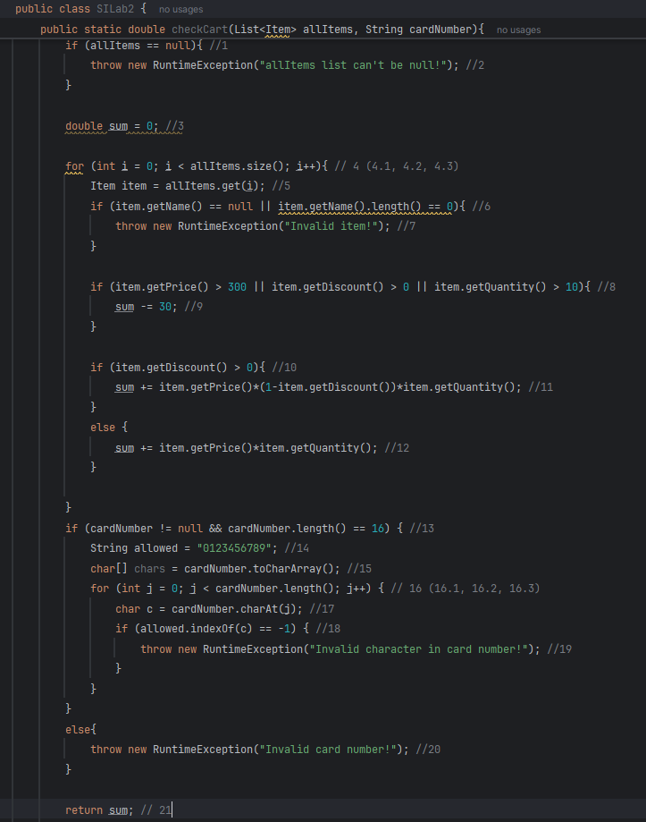

# SI_2025_lab2_233064

Radmila Popovska 233064

За дадениот код цикломатската комплексност е 9, а резултатот го добив како вкупен број на сите услови + 1.

Every Statement - тест случаи

Потребни се минимум 6 тестови, се со цел да се опфати секоја линија барем еднаш.

Тест 1 - allItems е null, се фрла исклучок: "allItems list can't be null!"

Тест 2 - item.name е null, се фрла исклучок: "Invalid item!"

Тест 3 - Важи item.getPrice() > 300 || getDiscount() > 0 || getQuantity() > 10, и discount > 0, sum = -30 + 500*(1-0.2)*20 = -30 + 8000 = 7970

Тест 4 - Не важи условот if(...), и discount = 0

Тест 5 - cardNumber содржи карактер (а треба број), "Invalid character in card number!"

Тест 6 - cardNumber е null, се фрла исклучок"Invalid card number!"

Multiple Condition за условот if (item.getPrice() > 300 || item.getDiscount() > 0 || item.getQuantity() > 10)

За дадениот if услов, бидејќи има логички оператор || (OR), потребен е само еден точен услов за да биде точен целиот израз, или сите да се неточни за да биде false.

1. FFF - Сите три случаи мора да се проверат, бидејќи е логичко или и се добива false.
2. FTX - Првиот случај е false, но бидејќи вториот е true целиот услов е true и нема потреба да се проверува третиот.
3. FFT - Првиот и вториот случај се false, но третиот е true и целиот услов е true.
4. TXX - Доволно е само еден случај да е true и целиот услов е true.

